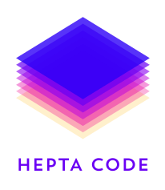

 

  # Ciao, siamo HeptaCode 👋
  
  Siamo il **gruppo 7** del corso "Ingegneria del Software" di UniPD anno 2025/2026.
  
  Il team è composto da:

  | Mebro            | Matricola | profilo GitHub  |
  | :---             | :---:     | ---:            |
  | Riccardo Baldin  | 2075548 | [RiccardoBaldin](https://github.com/RiccardoBaldin)  |
  | Angela Canazza   | 2111030 | [CNangela](https://github.com/CNangela)        |
  | Angela Favaro    | 2111015 | [AngelaFavaro](https://github.com/AngelaFavaro)    |
  | Alberto Reginato | matricola |                 |
  | Nicola Simionato | matricola | [NicSim](https://github.com/Astrubale023)          |
  | Amerigo Vegliante| matricola | [amerigovegliante](https://github.com/amerigovegliante)|
  | Laura Venturini  | 2101061 | [VentiLaura](https://github.com/VentiLaura)      |
  
  # Dai un'occhiata al [sito web](https://heptacode-unipd.github.io/)
  

